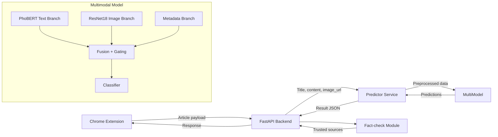

# Multimodal Fake News Detection Architecture

## Overview

The system is composed of three main layers:

- Chrome Extension
- Backend FastAPI service
- GPU inference server hosting the multimodal PyTorch model

## Architecture Diagram

## Component Responsibilities

- **Chrome Extension**: captures page metadata, article body, and main image, then calls backend `/predict`.
- **FastAPI Backend**: validates inputs, rate limits clients, performs inference, and returns label, confidence, modality weights, fact-check score and explanation.
- **MultiModel**: a PyTorch model with a text branch, image branch, metadata branch, gating network, and classifier.
- **Fact-check Module**: queries trusted sources and scores results to improve explainability.
